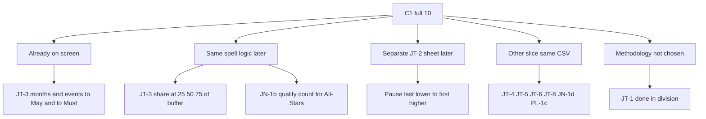

# Time in Division × Board C1 — product match audit

**Status:** locked 2026-09-24 · **sheets shipped** on live dashboard (Threshold / May→MUST corridor / Division pause / All-Stars qualify)  
**Live tool:** [time_in_division_dashboard_en.html](https://wsdc-analytics.github.io/time_in_division_dashboard_en.html)  
**Builder:** `scripts/update_time_in_division_spells.py` · payload `static/data/time_in_division_spells.json`  
**Board source:** [appendix_en.html](appendix_en.html) · [MATRIX.md](MATRIX.md)

This document matches the **current** Time in Division product to **C1 full** Board asks. It does **not** ship new charts. Build work (JT-2 sheet, buffer %, JN-1b counters) is deferred until separately commissioned.

## Closed-bar rule

Closed by **comment intent**, not every phrase of the Board quote.

- **May** and **Must** are **two separate threshold metrics**. Each answers: inclusive months and unique event editions from first point in that division×role until that threshold (allowed or required).
- They are **not** a definition of “done in that division.” JT-1 stays open until “done” is chosen case-by-case.

## Current mechanism (what the tool actually measures)

| Piece | Behavior |
|-------|----------|
| Unit | Spell = dancer × division × role |
| Clocks | Inclusive calendar months (same month = 1; Nov→Mar = 5); unique editions (`name\|YYYY-MM`) up to the selected crossing |
| Population on chart | Only spells that **crossed** the selected threshold |
| Display filter | Done year in From–To; Nov/Int/Adv floor 2018, All-Stars 2021 — **display only**; history before the floor still counts toward months/events |
| Divisions in UI | Novice, Intermediate, Advanced, All-Stars (Champions parsed but not plotted) |

---

## C1 full — match table

| ID | Board ask (short) | Match to Time in Division | Verdict |
|----|-------------------|---------------------------|---------|
| **JT-3** | Time to may / must (+ stay for 25/50/75% of extra points) | May/Must months & events on Scatter / Density / Dynamics / Table | **Closed for threshold clocks.** Buffer 25/50/75% **not** built |
| **JT-1** | Time from first point until “done”; include those not yet done | “Done” undefined (may be May, Must, last point, or exit). Open spells would mix medians | **Not covered** — do not add until methodology exists |
| **JT-2** | Time from last point in lower division to first in higher | Different clock; **no scoring events in that gap** by construction — scatter months×events is wrong | **Separate sheet** (see below) — not current axes |
| **JN-1b** | How many people qualified for All-Stars over 10+ years | Same crossings, different viz: cumulative count (Advanced allowed vs first AS point), label which series | **Extend same spell** later |
| **JT-4** | Events-with-a-point per competitor per year (+ bins) | Activity, not time-to-threshold | **Other tool** |
| **JT-5** | Events × division × tier mix per year | Event×tier slice | **Other tool** |
| **JT-6** | Counterfactual move-down if old points discounted | Point-age simulation; policy = JT-6b (C5) | **Other tool** |
| **JT-8** | Event size YOY + nearby new events if shrinking | Event landscape | **Other tool** |
| **JN-1d** | Champions with no point post-COVID | Inactivity on Champions | **Other tool** |
| **PL-1c** | Points awarded to people with &lt;11 career Champion points | Join placement to career Champ total | **Other tool** |

---

## Already closed on this dashboard

### JT-3 — threshold clocks only

Two metrics, May / Must toggle:

- Months and events until that threshold
- Medians, Leader/Follower, year of crossing
- Matches MATRIX comment “Time-to-allowed/required”

Does **not** claim to answer “finished the division.”

---

## Same spell logic — later product work (not this lock)

### JT-3 — buffer corridor

Between allowed and required, “extra” points = required − allowed. Share who reached 25% / 50% / 75% of that buffer (and months/events to each). Requires intermediate marks in `find_*_crossings`, not only the crossing moment. Separate corridor chart — not the inter-division pause.

### JN-1b — qualify counts

Cumulative people over 10+ years:

1. Advanced **allowed** (eligible to enter All-Stars), and/or  
2. First **All-Stars** point (actually competed up)

Same spell crossings; cohort/year counters with explicit series labels. Dwell year floor must not silently drop long-horizon qualify counts.

---

## JT-2 — why current axes fail; intended sheet

**Quote:** length of time from last point in a lower division to first point in the higher division.

Inside that interval there are **no points in those two divisions**: lower streak ended, higher not started. Events-to-threshold Y would be 0 for everyone (or you’d invent “other events / attendance”), which is a different ask.

| Clock | May / Must | JT-2 pause |
|-------|------------|------------|
| Start | First point in division D | Last point in D |
| End | Crossing allowed or required in D | First point in D+1 |
| Length | Inclusive months + editions to threshold | Inclusive months only |
| Events axis | Meaningful | Empty by definition for D ∪ D+1 in the gap |

**Row definition (when built):**

- Transitions: Novice→Intermediate, Intermediate→Advanced, Advanced→All-Stars, All-Stars→Champions; role not mixed
- Inclusive months (same as dwell)
- Overlap (first higher before last lower): flag; **exclude from pause median**
- Payload: separate `transitions[]` next to spells — not a field inside allowed/required
- Do **not** reuse dwell year floors (2018 / 2021) — not a may/must corridor question

**UI (when built):**

1. **Distribution sheet** — histogram/density of pause months; filters: ladder step, role, year of first higher point; KPI: n transitions, median months, overlap share; table: id, name, role, from→to, last_ym, first_ym, months  
2. **Dynamics** — same KPI-card pattern: median pause months by year of **first point in the higher division**; Overall vs Leaders & Followers; keep n≥10 on median lines  
3. Never mix pause median with May/Must months on one chart without an explicit sheet switch

Data source remains `dancers_results_info.csv`.

---

## JT-1 — methodology not chosen

“Done in that division” may mean May, Must, last point, or leave. Until Board/committee pick a case rule, do **not** add open/censored spells into this tool — they would corrupt threshold medians.

---

## C1 partial — scored answers elsewhere (short)

| Direction | IDs | Note |
|-----------|-----|------|
| Same threshold family if Champions spell / chain added | JN-1c (time pieces), JN-1a (scored trajectory), KY-1 (scored progression slice) | “Attends” / Entry majority = C2 |
| Other scored slices (label Scored) | YV-1, YV-3, JN-2a, JN-2b, JN-3a, JT-7, KY-2, PL-1a, JC-3a (age J&J with points only) | Not this dashboard |

Do not promise from current CSVs: **C2** (Entry lists), **C3**, **C4**, **C5**.

---

## Summary

| Bucket | C1 full IDs | Product |
|--------|-------------|---------|
| On screen — Threshold sheet | JT-3 months & events to May / Must | Sheet **Threshold** |
| On screen — Corridor sheet | JT-3 buffer 25/50/75% (+ Must share) | Sheet **May→MUST corridor** |
| On screen — Pause sheet | JT-2 pause months (+ Dynamics) | Sheet **Division pause** |
| On screen — Qualify sheet | JN-1b Advanced allowed vs first AS point | Sheet **All-Stars qualify** |
| Methodology blocked | JT-1 | — |
| Other tool, same registry CSVs | JT-4, JT-5, JT-6, JT-8, JN-1d, PL-1c | Outside this dashboard |

**Next:** other C1 full tools (JT-4…), not more dwell sheets, unless Board picks JT-1 “done” methodology.
